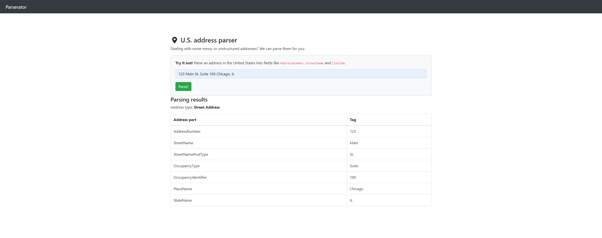

## Overview

This PR brings functionality to the Parserator page.

You can type in an address into the input bar and it will parse an us address and display its type,
parts, and tags.

It will also display any errors that may happen.

Closes #XXX

### Demo

### Notes

The unit testing for the error is somewhat simple, just checking for a 400 error.
The error response is quite lengthy so for the sake of brevity kept the error testing short.

I also updated the Dockerfile to use a non-deprecated link for Node, the old one wasnt working.

## Testing Instructions

- Clone the directory
- If you are using a Windows machine, make sure the docker-entrypoint.sh is using LF for its end of line sequence.
- In the directory use "docker compose build"
- Then use "docker compose up"
- go to localhost:8000 on your preferred browser
- Input any US address you want to parse
